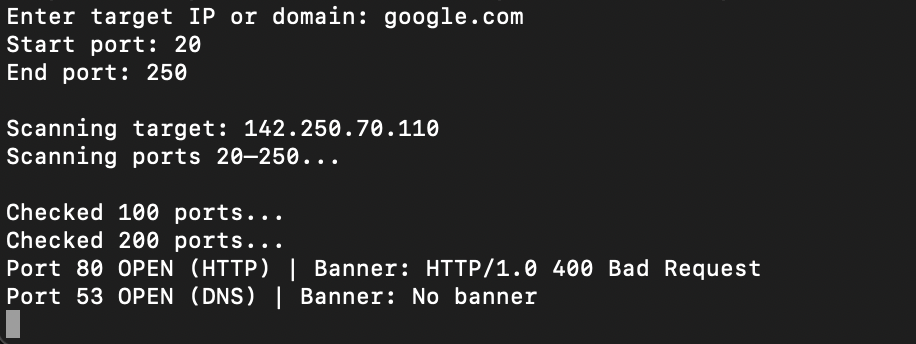

# Python Port Scanner

A multithreaded TCP port scanner built using Python to identify open ports and running network services.

## Features

- Multithreaded TCP port scanning
- Custom port range scanning
- Service detection for common ports
- Banner grabbing for service identification
- Scan timing statistics
- Scan progress indicator
- Export scan results to file

## Technologies

- Python
- Socket Programming
- TCP/IP Networking
- Multithreading

## Usage

```bash
python src/scanner.py '''

'''
Example:

Enter target IP or domain: scanme.nmap.org
Start port: 20
End port: 200

'''


## Sample Output

